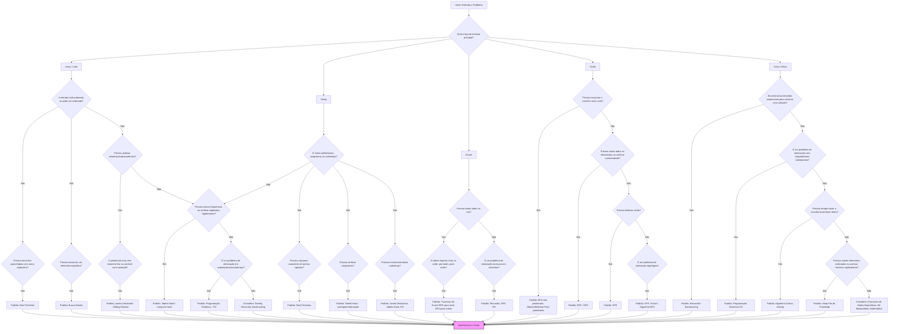

# Fluxograma e Padrões Comuns em Desafios de Código

Este documento apresenta um fluxograma visual para ajudar a identificar padrões comuns em problemas de programação competitiva e entrevistas técnicas. Após o fluxograma, cada categoria principal de entrada é detalhada com os padrões associados e quando considerá-los.

## Fluxograma Visual (Mermaid)

O fluxograma abaixo guia o processo de pensamento ao analisar um novo problema, começando pelo tipo de entrada principal.

## Explicação Rápida dos Termos

Entenda o Problema: Leia cuidadosamente, identifique entradas, saídas e restrições.

- Array / Lista: Sequência de elementos.
- String: Sequência de caracteres.
- Árvore: Estrutura de dados hierárquica.
- Grafo: Nós conectados por arestas.
- Ordenado: Elementos em ordem crescente ou decrescente.
- Dois Ponteiros: Usar dois índices (ponteiros) que se movem pela estrutura (geralmente array ordenado ou string).
- Busca Binária: Técnica eficiente para encontrar um elemento em uma estrutura ordenada.
- Subarrays/Subsequências: Partes contíguas (subarray) ou não necessariamente contíguas (subsequência) da estrutura original.
- Janela Deslizante (Sliding Window): Técnica para processar subarrays/substrings de tamanho fixo ou variável de forma eficiente.
- Tabela Hash / Conjunto Hash: Estruturas para armazenamento e busca rápida (O(1) em média), úteis para contagem de frequência, verificação de   duplicatas, etc.
- Programação Dinâmica (PD): Resolver problemas complexos quebrando-os em subproblemas menores e sobrepostos, armazenando resultados intermediários.
- Greedy (Guloso): Fazer a escolha localmente ótima em cada passo na esperança de encontrar a solução global ótima.
- Recursão / Backtracking: Definir um problema em termos de si mesmo / Explorar todas as soluções possíveis, voltando atrás quando um caminho não leva a uma solução.
- Travessia de Árvore/Grafo (BFS/DFS): Métodos para visitar todos os nós (Busca em Largura - BFS, Busca em Profundidade - DFS).
Heap (Fila de Prioridade): Estrutura para manter elementos com acesso rápido ao mínimo/máximo.
Implementar e Testar: O passo final após escolher uma abordagem.

## Detalhamento por Tipo de Entrada

### Array / Lista

Problemas envolvendo arrays (ou listas) são extremamente comuns. A estrutura e as propriedades do array (como ordenação) frequentemente sugerem o padrão a ser utilizado.

*   **Dois Ponteiros (Two Pointers):**
    *   **Quando usar:** Frequentemente aplicável se o array estiver **ordenado** (ou puder ser ordenado eficientemente). Útil para encontrar pares ou triplas que satisfaçam uma condição (ex: soma alvo), ou para problemas onde você compara/processa elementos de ambas as extremidades do array movendo os ponteiros para dentro.
*   **Busca Binária (Binary Search):**
    *   **Quando usar:** Use quando o array estiver **ordenado** e você precisar encontrar a **posição de um elemento específico** ou o primeiro/último elemento que satisfaça uma condição. Funciona em tempo O(log n). Também aplicável em problemas onde você pode "adivinhar" uma resposta e verificar se ela é viável, e o espaço de busca das respostas é monotônico (se uma resposta `x` funciona, `x+1` também funciona, ou vice-versa).
*   **Janela Deslizante (Sliding Window):**
    *   **Quando usar:** Ideal para problemas que pedem para encontrar um **subarray** (ou substring) contíguo que satisfaça alguma propriedade (ex: soma máxima/mínima, contagem específica de caracteres, etc.). A janela pode ter tamanho fixo ou variável. A chave é expandir e contrair eficientemente a janela para evitar recalcular tudo a cada passo.
*   **Tabela Hash / Conjunto Hash (Hash Table / Hash Set):**
    *   **Quando usar:** Essencial quando você precisa de **contagem de frequência** de elementos, verificação rápida de **existência/duplicatas**, ou agrupar elementos (como anagramas). Oferece complexidade média de O(1) para inserção, remoção e busca.
*   **Programação Dinâmica (PD):**
    *   **Quando usar:** Se o problema pede uma **solução ótima** (máximo, mínimo, contagem total) sobre **subsequências ou subarrays**, e pode ser quebrado em **subproblemas menores e sobrepostos**. Exemplos incluem a subsequência crescente mais longa, soma máxima de subarray (embora Kadane seja mais simples para este último), ou problemas de contagem de caminhos em uma grade representada como array.
*   **Algoritmo Guloso (Greedy):**
    *   **Quando usar:** Se fazer a **escolha localmente ótima** em cada passo leva à solução global ótima. Comum em problemas de agendamento, seleção de atividades, ou quando você pode ordenar a entrada e processá-la sequencialmente tomando a melhor decisão imediata. Requer prova cuidadosa de que a estratégia gulosa funciona.
*   **Recursão / Backtracking:**
    *   **Quando usar:** Para gerar todas as combinações, permutações ou subconjuntos de elementos do array. Backtracking é uma forma de recursão que explora caminhos e "volta atrás" se um caminho não leva a uma solução válida.

### String

Strings são essencialmente arrays de caracteres, então muitos padrões de array se aplicam, mas alguns são particularmente comuns com strings.

*   **Dois Ponteiros:**
    *   **Quando usar:** Similar aos arrays, útil para verificar **palíndromos** (ponteiros nas extremidades movendo-se para o centro) ou outros problemas que envolvem comparar/processar caracteres de posições simétricas ou relativas.
*   **Tabela Hash (Contagem):**
    *   **Quando usar:** Fundamental para verificar **anagramas** (contando a frequência de cada caractere em ambas as strings) ou encontrar substrings com certas propriedades de caracteres (usado em conjunto com Janela Deslizante).
*   **Janela Deslizante:**
    *   **Quando usar:** Para encontrar **substrings** que satisfaçam condições específicas (ex: substring mais longa sem caracteres repetidos, menor substring contendo todos os caracteres de outra string, contagem de anagramas de um padrão dentro de um texto).
*   **Programação Dinâmica (PD):**
    *   **Quando usar:** Problemas clássicos como **Distância de Edição (Edit Distance)**, **Subsequência Comum Mais Longa (Longest Common Subsequence)**, ou verificar se uma string pode ser segmentada em palavras de um dicionário. Geralmente envolve uma tabela 2D `dp[i][j]` representando uma solução para prefixos das strings.
*   **Estruturas de Dados Específicas (Trie, KMP):**
    *   **Quando usar:** Tries (Árvores de Prefixos) são excelentes para problemas envolvendo múltiplos padrões, prefixos ou autocompletar. O algoritmo KMP é otimizado para encontrar ocorrências de um padrão único dentro de um texto longo.

### Árvore

Problemas de árvore geralmente envolvem travessia ou exploração da estrutura hierárquica.

*   **Travessia (BFS / DFS):**
    *   **BFS (Busca em Largura):** Use quando precisar explorar a árvore **nível por nível**. Ideal para encontrar o **caminho mais curto** em termos de número de arestas (em árvores não ponderadas), ou para problemas de "ordem de nível" (level order traversal). Usa uma fila.
    *   **DFS (Busca em Profundidade):** Use para explorar um ramo completamente antes de passar para o próximo. Naturalmente implementado com **recursão** (ou uma pilha explícita). Adequado para travessias **pré-ordem, em-ordem, pós-ordem**, verificar caminhos, encontrar profundidade, ou quando a ordem exata de visita por nível não importa.
*   **Recursão:**
    *   **Quando usar:** A natureza recursiva das árvores torna a recursão uma abordagem muito natural. Problemas como calcular altura, verificar se é uma Árvore de Busca Binária (BST), encontrar o Menor Ancestral Comum (LCA), ou construir/serializar árvores são frequentemente resolvidos recursivamente, definindo a solução para um nó em termos das soluções para seus filhos.
*   **Programação Dinâmica (PD em Árvores):**
    *   **Quando usar:** Para problemas de otimização em árvores onde a solução para um nó depende das soluções ótimas de seus filhos (ex: diâmetro da árvore, maior soma de caminho).

### Grafo

Grafos modelam relações entre entidades. Os algoritmos dependem se o grafo é direcionado/não direcionado, ponderado/não ponderado, e o que se busca.

*   **BFS (Busca em Largura):**
    *   **Quando usar:** Encontrar o **caminho mais curto em grafos não ponderados**. Também usado para travessia geral, verificação de conectividade e detecção de ciclos bipartidos.
*   **DFS (Busca em Profundidade):**
    *   **Quando usar:** Travessia geral, **detecção de ciclos** (usando estados de visita), encontrar componentes conectados/fortemente conectados, **ordenação topológica** (para Grafos Acíclicos Direcionados - DAGs).
*   **Algoritmos de Caminho Mais Curto (Ponderado):**
    *   **Dijkstra:** Para encontrar o caminho mais curto de uma única fonte para todos os outros nós em grafos **ponderados sem pesos negativos nas arestas**. Geralmente implementado com uma fila de prioridade (heap).
    *   **Bellman-Ford:** Encontra o caminho mais curto de uma única fonte, mesmo com **pesos negativos nas arestas**. Também pode detectar ciclos negativos. Mais lento que Dijkstra.
    *   **Floyd-Warshall:** Encontra o caminho mais curto entre **todos os pares** de nós. Funciona com pesos negativos (mas detecta ciclos negativos). Complexidade O(V³).
*   **Ordenação Topológica:**
    *   **Quando usar:** Para ordenar os nós de um **Grafo Acíclico Direcionado (DAG)** de forma que para toda aresta direcionada `u -> v`, o nó `u` venha antes do nó `v` na ordenação. Útil em problemas de agendamento de tarefas com dependências. Pode ser feito com DFS ou com o algoritmo de Kahn (baseado em graus de entrada e BFS).
*   **Árvore Geradora Mínima (MST - Minimum Spanning Tree):**
    *   **Quando usar:** Em grafos **ponderados e não direcionados**, para encontrar um subconjunto de arestas que conecta todos os vértices sem ciclos e com o menor peso total possível. Algoritmos comuns: **Prim** (similar a Dijkstra) e **Kruskal** (guloso, baseado em ordenar arestas e usar Union-Find).

### Outro / Misto

Esta categoria abrange padrões que podem se aplicar a vários tipos de dados ou problemas mais gerais.

*   **Recursão / Backtracking:**
    *   **Quando usar:** Quando a solução envolve **explorar múltiplas possibilidades** ou tomar uma sequência de decisões. Útil para gerar permutações, combinações, subconjuntos, resolver quebra-cabeças (Sudoku, N-Queens), ou encontrar caminhos em matrizes/grafos. Backtracking "poda" a busca quando um caminho parcial se mostra inviável.
*   **Programação Dinâmica (PD):**
    *   **Quando usar:** Problemas de **otimização** (encontrar máximo/mínimo) ou **contagem** que exibem **subestrutura ótima** (a solução ótima do problema principal pode ser construída a partir das soluções ótimas de seus subproblemas) e **subproblemas sobrepostos** (os mesmos subproblemas são resolvidos múltiplas vezes). Requer identificar o estado da DP e a relação de recorrência. Pode ser implementada com memoização (top-down) ou tabulação (bottom-up).
*   **Algoritmo Guloso (Greedy):**
    *   **Quando usar:** Quando uma sequência de **escolhas localmente ótimas** leva a uma solução globalmente ótima. Requer uma "propriedade de escolha gulosa" e "subestrutura ótima". Exemplos: problema do troco (com certas moedas), compressão de Huffman, alguns problemas de agendamento (Interval Scheduling), Kruskal e Prim para MST.
*   **Heap (Fila de Prioridade):**
    *   **Quando usar:** Quando você precisa manter uma coleção de elementos e **acessar/remover eficientemente o elemento mínimo ou máximo**. Útil para encontrar os K maiores/menores elementos, implementar Dijkstra/Prim, ou em simulações onde eventos são processados por prioridade (tempo).
*   **Bit Manipulation (Manipulação de Bits):**
    *   **Quando usar:** Para otimizar operações em conjuntos pequenos (usando bits como flags), realizar operações aritméticas rápidas (multiplicação/divisão por 2), ou resolver problemas onde o estado pode ser representado compactamente por bits (ex: DP com máscaras de bits).
*   **Matemática:**
    *   **Quando usar:** Problemas envolvendo teoria dos números (primos, MDC, MMC), combinatória, probabilidade, geometria ou outras áreas matemáticas. Às vezes, uma visão matemática pode simplificar drasticamente um problema.
